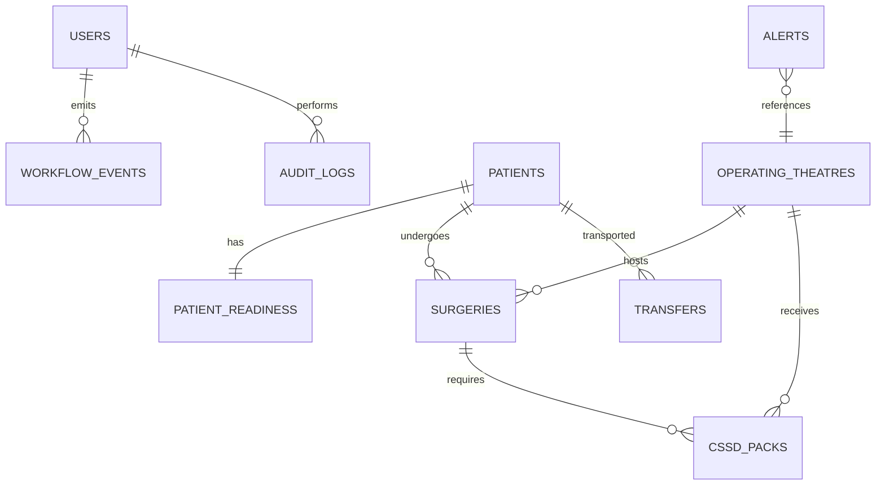

# SmartOT Command: Database Design & Schema

SmartOT Command uses a relational schema with foreign key integrity and immutable event tracking.

## Entity Details

### 1. `users`
- `id`: `VARCHAR(64)` PRIMARY KEY
- `email`: `VARCHAR(128)` UNIQUE
- `name`: `VARCHAR(128)`
- `role`: `ENUM('ADMINISTRATOR', 'OT_MANAGER', 'CSSD_STAFF', 'WARD_STAFF')`
- `department`: `VARCHAR(128)`
- `createdAt`: `TIMESTAMP`

### 2. `patients`
- `id`: `VARCHAR(64)` PRIMARY KEY
- `mrn`: `VARCHAR(64)` UNIQUE (Synthetic Medical Record Number)
- `name`: `VARCHAR(128)`
- `age`: `INT`
- `gender`: `ENUM('M', 'F', 'OTHER')`
- `wardId`: `VARCHAR(64)`
- `bedNumber`: `VARCHAR(32)`
- `admissionDate`: `TIMESTAMP`
- `status`: `ENUM('ADMITTED', 'PREPARING', 'READY_FOR_OT', 'IN_TRANSFER', 'IN_OT', 'IN_SURGERY', 'POST_OP', 'DISCHARGED')`
- `primaryDiagnosis`: `TEXT`

### 3. `patient_readiness`
- `id`: `VARCHAR(64)` PRIMARY KEY
- `patientId`: `VARCHAR(64)` FK -> `patients.id`
- `admissionCompleted`: `BOOLEAN`
- `consentStatus`: `ENUM('PENDING', 'VERIFIED', 'MISSING')`
- `documentationCompleted`: `BOOLEAN`
- `reportsAvailable`: `BOOLEAN`
- `doctorConfirmed`: `BOOLEAN`
- `preopPrepCompleted`: `BOOLEAN`
- `completedItemsCount`: `INT` (0 to 6)
- `totalItemsCount`: `INT` (Default: 6)
- `isReady`: `BOOLEAN` (True only when count == 6 and consent == 'VERIFIED')
- `updatedAt`: `TIMESTAMP`

### 4. `operating_theatres`
- `id`: `VARCHAR(64)` PRIMARY KEY
- `code`: `VARCHAR(32)` UNIQUE (e.g. `OT-01`, `OT-02`, `OT-03`, `OT-04`)
- `name`: `VARCHAR(128)`
- `specialty`: `VARCHAR(128)`
- `currentStatus`: `ENUM('SCHEDULED', 'PREPARING', 'PATIENT_READY', 'PATIENT_TRANSFER', 'PATIENT_ARRIVED', 'OT_READY', 'SURGERY_STARTED', 'SURGERY_COMPLETED', 'TURNOVER', 'AVAILABLE', 'DELAYED')`
- `activeSurgeryId`: `VARCHAR(64)` FK -> `surgeries.id` (Nullable)
- `turnoverStartedAt`: `TIMESTAMP` (Nullable)
- `expectedTurnoverMinutes`: `INT` (Default: 25)
- `currentDelayMinutes`: `INT`
- `riskLevel`: `ENUM('LOW', 'MEDIUM', 'HIGH')`

### 5. `cssd_packs`
- `id`: `VARCHAR(64)` PRIMARY KEY
- `packId`: `VARCHAR(64)` UNIQUE (e.g. `CSSD-021`)
- `packType`: `VARCHAR(128)`
- `sterilizationBatch`: `VARCHAR(64)`
- `sterilizedAt`: `TIMESTAMP`
- `expiresAt`: `TIMESTAMP`
- `sterilityStatus`: `ENUM('STERILIZED', 'UNSTERILIZED', 'EXPIRED')`
- `currentStatus`: `ENUM('COLLECTED', 'STERILIZING', 'STERILIZED', 'STORED', 'AVAILABLE', 'ASSIGNED', 'IN_USE', 'RETURNED', 'REPROCESSING', 'EXPIRED', 'BLOCKED')`
- `currentLocation`: `VARCHAR(128)`
- `assignedOtId`: `VARCHAR(64)` (Nullable)

### 6. `workflow_events` (Immutable Stream)
- `id`: `VARCHAR(64)` PRIMARY KEY
- `eventType`: `VARCHAR(64)`
- `entityType`: `VARCHAR(32)`
- `entityId`: `VARCHAR(64)`
- `department`: `VARCHAR(32)`
- `timestamp`: `TIMESTAMP`
- `actorId`: `VARCHAR(64)`
- `actorName`: `VARCHAR(128)`
- `metadata`: `JSON`
- `idempotencyKey`: `VARCHAR(128)` UNIQUE
