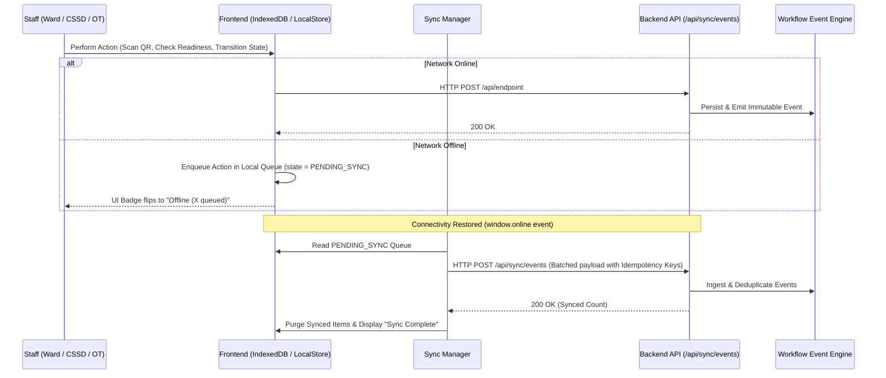

# SmartOT Command: Offline-First Architecture & Event Sync

## 1. Context & Motivation
Hospitals in developing or resource-constrained environments frequently experience intermittent local network outages and Wi-Fi dead zones in basement CSSD departments or shielded Operating Theatres.

SmartOT Command implements an **Offline-First Event Queue** to guarantee zero data loss during connectivity disruptions.

---

## 2. Synchronization Architecture

---

## 3. Idempotency & Deduplication
Every queued offline event generates a unique UUID-based `idempotencyKey`. When the sync payload reaches the server, the backend verifies that duplicate events are not re-executed, preserving historical timeline integrity.
