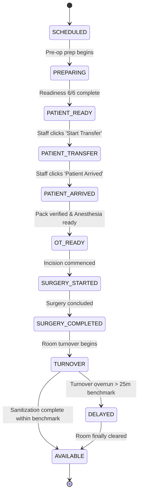
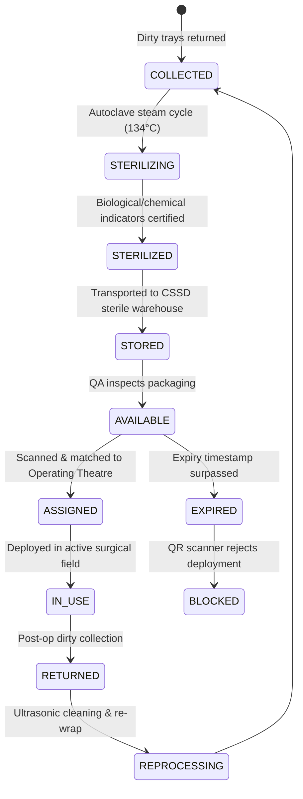

# SmartOT Command: Workflow State Machine Specifications

## 1. Operating Theatre State Machine

Operating Theatres move through a deterministic finite state machine where every valid transition generates an immutable workflow event.

### State Definitions:
- **`SCHEDULED`**: Procedure is booked in the daily surgical block.
- **`PREPARING`**: Ward nursing staff and OT circulator begin patient and tray staging.
- **`PATIENT_READY`**: Inpatient checklist is 6/6 verified and consent is signed.
- **`PATIENT_TRANSFER`**: Inpatient is in transit from Ward to Surgical Suite.
- **`PATIENT_ARRIVED`**: Patient has entered the sterile theatre anteroom.
- **`OT_READY`**: Anesthesia induction and sterile surgical trays verified.
- **`SURGERY_STARTED`**: Surgical incision started (`actualStartTime` logged).
- **`SURGERY_COMPLETED`**: Drapes down, patient extubated (`actualEndTime` logged).
- **`TURNOVER`**: Environmental cleaning and terminal disinfection in progress (`turnoverStartedAt` logged).
- **`AVAILABLE`**: Room certified ready for next surgical intake.
- **`DELAYED`**: Active procedural or turnaround overrun exceeding benchmark buffer.

---

## 2. CSSD Sterile Pack Lifecycle

---

## 3. Patient Journey Timeline
Every patient undergoes timestamped progression across departments:
$$\text{Admission} \longrightarrow \text{Documentation} \longrightarrow \text{Consent} \longrightarrow \text{Checklist (6/6)} \longrightarrow \text{Transfer} \longrightarrow \text{OT Arrival} \longrightarrow \text{Surgery} \longrightarrow \text{PACU/Recovery}$$
